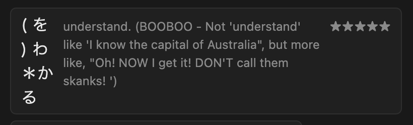
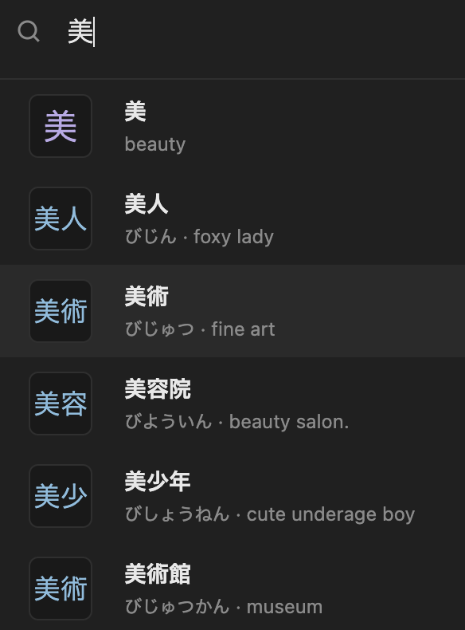
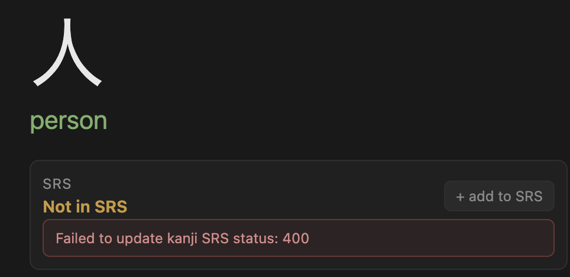

Importer
- [x] only 家 listed as a kanji for 建築家. Similar problem for 専門家. Need to search for more examples to fix this properly.
- [x] first 5 words aren't words

UI
- [x] display kun reading about reading description. Currently displays reading vertically to left of descriptino. For example, . Keep stars on same row as reading, justified right.
- [x] Kanji and Word display pages should clear pane stack and just display their lists. That includes removing the Home page
- [x] If a pane already exists for a kanji or word, clicking on the kanji/word again should scroll back to the existing pane. Instead nothing happens, which is confusing.
- [x] typing in Japanese mode searches on each keypress / selection of alternative kanji choices. This is great, but when I press Enter to select the correct spelling, the same Enter press goes to the search box and the search completes. This means I can't pick things from the list.
- [x] when typing in any lang, the search runs repeatedly on each keypress - good. But the search results flicker, perhaps with a "Loading.." message. Can we delay this considerably or switch to a spinner? The flickering is very distracting when typing quickly.
- [x] only 2 characters are shown for 3 character words. 

SRS
- [x] kanji cards should still show even without SRS data 
- [x] review count should be zero without import 
- [x] defect after hitting add to SRS on a kanji 
- [ ] SRS info on Kanji cards too big
- [ ] SRS card layout front and back
- [ ] add delay to again, hard, good, easy (or is it better without?)
- [ ] link words to word cards for better exploration

Code review
- [ ] clean up repetitiion in api.ts
- [x] clean up branching in app.ts createApp. Should we be using a lightweight router? Nest.js??
- [ ] refactor repositories.ts searchLibrary to have less duplication.
