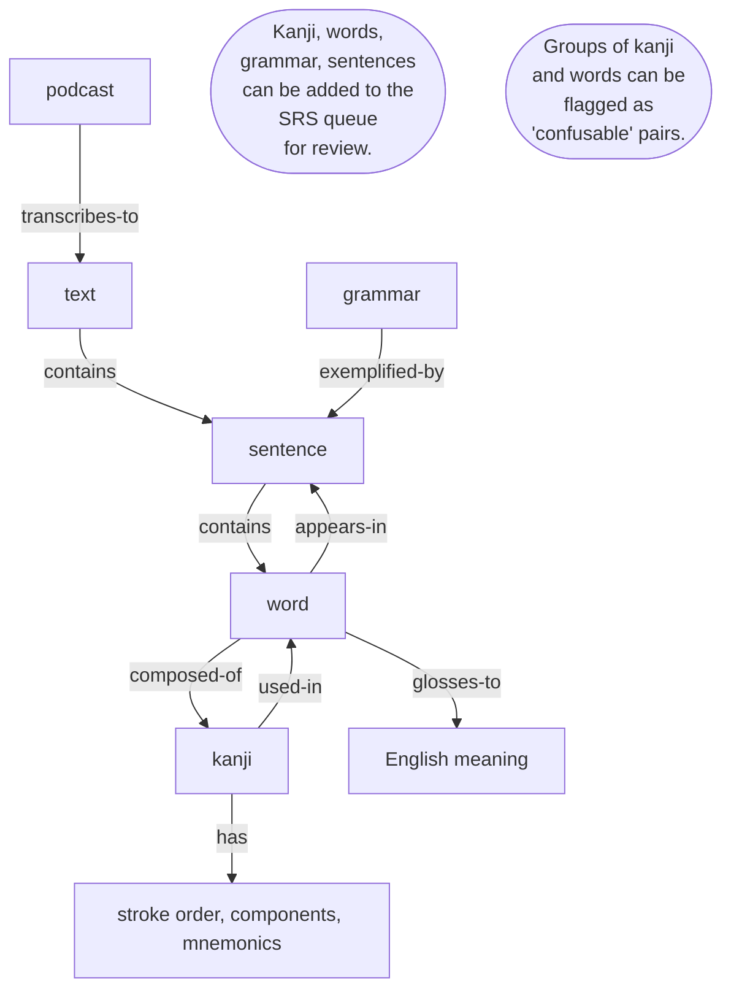

# Amika — Design Spec

Amika (網化) — "networkification." A personal Japanese learning workspace built around the graph of texts, words, kanji, and grammar you've actually encountered.

## 1. Vision

A personal Japanese learning workspace that helps you explore the language and grammar as you learn it. Everything Amika does is in service of keeping the user **exploring, adding, and reviewing** across their own corpus of Japanese.

The system is built around a **bidirectional graph of entities** (texts, words, kanji, grammar points), with **spaced repetition as a lens** over the graph rather than a separate app.

## 2. Core model

The entities and their relations:

Every relation is navigable from both ends. Every entity page ends with its backlinks.

## 3. UX principles

### 3.1 Tiling panes, not pages
Clicking a link opens a new pane *to the right* of the current pane. The user builds a horizontal reasoning trail (text → word → kanji → confusable) and can close panes to refocus. No modals for navigation.

### 3.2 Command palette (⌘K)
Typing any kanji, kana, romaji, English, or topic jumps to the match. 

### 3.3 Backlinks everywhere
Every entity page shows "appears in", "words using", "SRS cards referencing", etc. The graph is walkable from any node.

### 3.4 Inline SRS toggle
Every word/kanji/grammar point has a one-click toggle to add/remove from the review queue. No modals, no forms.

### 3.5 Selection-driven vocabulary growth
Text renders plainly; only words already in the user's library are highlighted. Selecting any JP text shows a floating lookup (reading, meaning, library/SRS status) with inline "+ Library" / "+ SRS" actions. Added words highlight on next render.

### 3.6 Home = activity feed + SRS queue
Recent additions, today's reviews, curated exploration cards (e.g. "You keep muddling 実 & 美"). Nothing more.

## 4. Ingestion

Three pipelines funnel into **one shared bilingual editor** (JP line / optional EN line pairs). The editor supports the same selection-lookup used across the app.

### 4.1 Teacher lessons
Paste email → parser extracts the structured vocab list (word / reading / meaning) → preview with checkboxes → import creates words and a lesson Text.

### 4.2 Podcast transcription
Upload .mp3 → split view (audio player + editor). Listening-practice flow: user types what they hear. Optional *reveal-after-commit* mode shows a hidden Whisper transcription line-by-line only after the user commits theirs.

### 4.3 Book pages (photo OCR)
Drag photos in → OCR produces JP text, one sentence per line. User writes their own EN translation underneath and selects unknown words as they go. Multi-page photos concatenate.

## 5. Dictionary stack

- **JMdict** (via [jmdict-simplified](https://github.com/scriptin/jmdict-simplified)) — word lookups
- **KANJIDIC2** — kanji metadata (readings, stroke count, radicals)
- **kuromoji.js** — morphological segmentation for long-text tokenization
- **User overrides** — stored separately; never mutate dictionary data

Runs locally (SQLite + small HTTP server, or fully client-side if acceptable).

## 6. SRS

Standard SM-2 or FSRS scheduling over the graph. Any entity can enter the queue. Reviews run in the Review pane; ratings are Again / Hard / Good / Easy.

## 7. Confusables

A special case worth naming. Kanji the user mixes up (e.g. 実/美) get a compare view with side-by-side components, a one-line semantic diff, and a drill card. Confusable pairs can be curated manually or — later — inferred from user error patterns in SRS.

## 8. Actions for different data types

### Kanji 
* **Display pane**: literal, readings, meaning, stroke count, stroke order diagram, components, mnemonics, JLPT grade, usefulness/frequency measures.
  * Navigate to: selected list of words.
* **SRS**: cards for recognition (kanji -> English/readings) and production (English/readings -> kanji). Result side is always the full kanji card.
* **List**: not yet spec'd

### Words
* **Display pane**: reading, meanings, JLPT level, usefulness/frequency measures.
  * The pane represents one dictionary entry. Searching for or encountering an alternative written form opens that same entry, rather than creating a separate dictionary word.
  * Navigate to: kanji it contains, sentences it appears in.
  * Initially, sentence backlinks are recorded only for words explicitly added to the user's library; importing a text does not create links for every dictionary match.
* **SRS**: cards for recognition (word -> English/reading) and production (English/reading -> word). A card preserves the encountered written form and selected learner-facing meaning when it is added. Result side is always the full dictionary entry card. To consider later: cloze cards for the word in an example sentence.
* **List**: not yet spec'd

### Search
Overview
* This section currently covers only the data that will be loaded soon: kanji and vocab.
* Search is across all loaded data, not just the user's library.
* Results: kanji group, then word group.
* Kanji group: show first four matches; expand for more.
* Within groups: order by usefulness/frequency if available, except where stated.
* No deinflection yet: `食べました` does not find `食べる`.
* Initial word matching is exact or prefix-based. Internal Japanese substring matching is deferred, except for the explicit single-kanji "words containing it" relation below.
* Initial English meaning matching is by complete word or word prefix within a meaning: `book` can match `school book`, while `earn` does not match `learning`.

Query types
* Type single kanji: 
  * Shows kanji
  * Shows words containing it, whether at start, middle, or end
* Type a multi-character query containing kanji: 
  * Shows entries for its first four kanji in input order; expands to show further kanji.
  * Shows an exact word-form match, highlighted.
  * Shows other word forms beginning with that string of characters.
  * Later extension: shows word forms containing that string internally and sentences containing the word.
* Type hiragana / katakana:
  * Treats hiragana and katakana readings as equivalent.
  * Shows kanji with that reading (maybe only those where it's the primary reading?)
  * Shows an exact word-form match, highlighted.
  * Shows exact and prefix matches among words that are typically written with those kana.
  * Shows exact and prefix reading matches; for example, `きょう` does not initially match `べんきょう`.
* Type English: 
  * Shows kanji with that complete word or word prefix in their core meaning.
  * Shows words with that complete word or word prefix in one of their meanings.
  * Later extension: shows sentences with that word in their translation

## 9. Open questions / deferred

- **Persistence**: local SQLite vs. IndexedDB vs. flat files. Probably SQLite behind a tiny local server.
- **Auto-ingest for lessons**: forward-to email address vs. manual paste. Start with paste.
- **Segmentation quality**: kuromoji.js is decent but not perfect for rare vocab. Accept imperfection at first.
- **SRS algorithm**: SM-2 is simpler; FSRS is better. Probably start SM-2, swap later.
- **Confusable detection from errors**: powerful but needs SRS history. Deferred.
- **Auth / multi-user**: not in scope. Single-user, local-first.
- **Alternative written forms in kanji results**: decide whether rare or irregular spellings cause an entry to appear in a kanji-to-word search. For example, `すり鉢` also has rare forms `擂り鉢` and `摺り鉢`; searching for `擂` or `摺` could include that entry or limit results to more typical forms.

## 10. Non-goals

- Replacing Anki for users who already have a working deck
- Being a complete Japanese course or textbook
- Cloud sync (yet)
- Multiple languages
